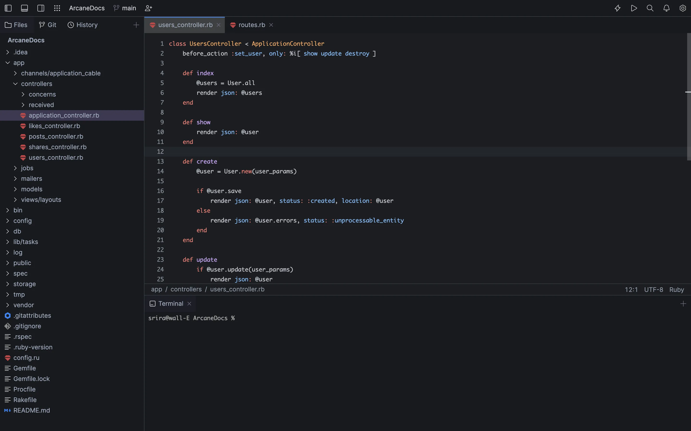

## Fleet Github Theme
A basic Github dark color-scheme based theme for the new Jetbrains editor Fleet

### preview:

## Usage
Download the `github-dark.json` file and move it to the `.fleet/themes/` in your pc or laptop. Now, open the Fleet editor, go to preferences, select theme, choose `Github Dark`.

The theme is still under development, as of now only the editor's syntax colors are modified, the UI's colors are yet to change.